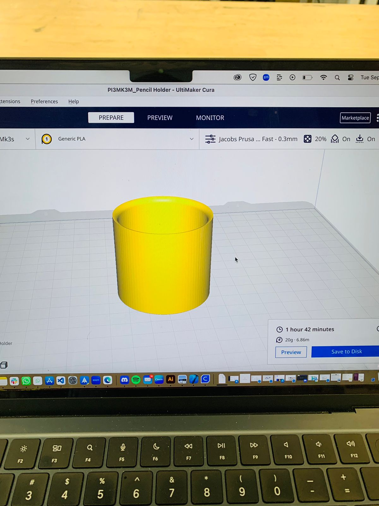

# Hello,

I'm **Shryas Bhurat**, an **Engineer**, **Designer**, & **Entrepreneur**.

Incredibly passionate about merging:
- Science
- Design
- Technology
- Entrepreneurship

To improve the quality of life on our Planet.

# TDF Weekly Progress
[week 1](README.md#week-1-example-report-1)

---
# About Me

My underlying motivation has consistently been a commitment to making a meaningful impact on the lives of those around me. This commitment has taken me from the realm of social entrepreneurship to deep technology missions building satellites, always driven by the pursuit of meaningful work.

My professional interests lie at the intersection of:
- Science
- Technology
- Entrepreneurship

I derive great satisfaction from experimentation and the creation of innovative solutions. My approach is characterized by:

- Deep curiosity
- Exploration of a wide range of subjects and research areas
- Enhancement of critical thinking skills
- Development of solutions contributing to the efficiency and well-being of life on our planet

Beyond my professional endeavors, I'm passionate about:

- Immersing myself in different cultures
- Engaging in introspection while traveling, particularly in natural environments

I am dedicated to leveraging these opportunities at MDes:
- Insights from psychology
- People-centered design principles
- Effective problem-solving techniques

**Mission**: To address the most pressing challenges of this decade.

---------------------------------------------------------------------------------------------------------

# Week 1: Personalizing My New Berkeley Home #
## Week of 09/05/2024

After moving to Berkeley, I have moved to a new home and wanted to make it more personal space, hence this week I worked on mini projects for my study table and home.

## DIY Projects

### Cool Pencil Stand

I made a cool pencil stand to organize my writing tools and add a unique touch to my study area. This custom-made stand not only serves a practical purpose but also reflects my personal style.

    
    
    

### Custom Keychain

For my new home keys, I created a custom keychain. This personalized accessory helps me easily identify my house keys and adds a bit of flair to my everyday items.

    
    
    

### Cal Logo for My Table

To show my connection to my new academic community, I made a Cal Logo for my table. This decorative piece proudly displays my affiliation with the University of California, Berkeley, and adds a touch of school spirit to my study space.

    
    

## Impact

These DIY projects have helped me transform my new living space into a more personalized environment. By adding these custom touches, I've begun to make my new Berkeley home feel more like my own.

---

## Quick Links ##

- [TDF Wiki](https://github.com/Berkeley-MDes/24f-desinv-202/wiki) - the ultimate source for truth and information about the course and assignments
- [Google Drive Folder](https://drive.google.com/drive/u/0/folders/1DJ1b6sSDwHXX6NRcQYt10ivyQSgU0ND6) - slides and other resources
- [bCourses](https://bcourses.berkeley.edu/courses/1537533) - where the grading happens
