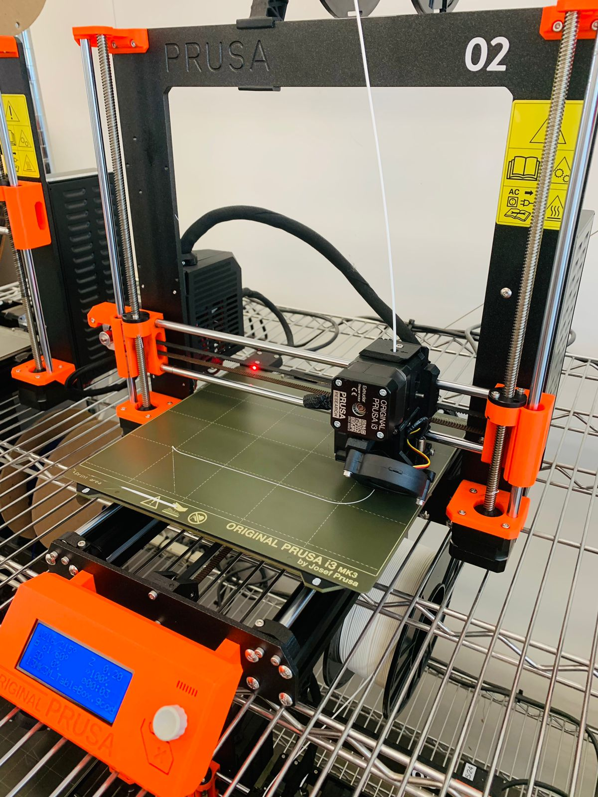

# Hello,

I'm **Shryas Bhurat**, an **Engineer**, **Designer**, & **Entrepreneur**.

Incredibly passionate about merging:
- Science
- Design
- Technology
- Entrepreneurship

To improve the quality of life on our Planet.

# TDF Weekly Progress
[week 1](README.md#week-1-personalizing-my-new-berkeley-home) , 
[week 2](README.md#week-2-making-a-phone-stand-using-Rhino) 

---------------------------------------------------------------------------------------------------------

# Week 2: Exploring Rhino, Grasshopper and 3D Printing this week #
## Week of 09/07/2024

Rhino seems like an interesting software to build things as it is parametric and things can be edited quite quickly because of this. I wanted to make the phone stand for my phone dimensions so that I could keep it comfortably on my study table.

Here's how it went like:

My Understanding on Parametric Modeling

    

I tried to edit the parameters to the iPhone XR dimensions

    
    

However, it did not work at the first instant as the base thickness was limited and the CG was going outside the stability criteria, I hence had to change the angle of the phone to make it more stable.

    
    

It worked, the phone was more stable and I could bake the results instantly & then I tried to replace the base with a cylinder.

    
    
     

They then created a 3D file to print the output so that I could use it.

I also tried to make a model from scratch using Grasshopper, to keep things near my bed sorted.

    
    
     

It was fun to play with parameters and very quick iterations.

---------------------------------------------------------------------------------------------------------

# Week 1: Personalizing My New Berkeley Home #
## Week of 09/05/2024

After moving to Berkeley, I moved to a new home and wanted to make it more personal space, hence this week I worked on mini projects for my study table and home.

## DIY Projects

### Cool Pencil Stand

I made a cool pencil stand to organize my writing tools and add a unique touch to my study area. This custom-made stand serves a practical purpose and reflects my style using 3D Printing.

    
    
    

### Custom Keychain

For my new home keys, I created a custom keychain. This personalized accessory helps me easily identify my house keys and adds a bit of flair to my everyday items using 3D Printing.

    
    
    

### Cal Logo for My Table

I made a Cal Logo for my table to show my connection to my new academic community. This decorative piece proudly displays my affiliation with the University of California, Berkeley, and adds a touch of school spirit to my study space using Laser Cutting.

    
    

## Impact

These DIY projects have helped me transform my new living space into a more personalized environment. By adding these custom touches, I've begun to make my new Berkeley home feel more like my own.

In the future, I will try to merge technology tools to build something that can solve my problems in the quickest way possible.

---

## Quick Links ##

- [TDF Wiki](https://github.com/Berkeley-MDes/24f-desinv-202/wiki) - the ultimate source for truth and information about the course and assignments
- [Google Drive Folder](https://drive.google.com/drive/u/0/folders/1DJ1b6sSDwHXX6NRcQYt10ivyQSgU0ND6) - slides and other resources
- [bCourses](https://bcourses.berkeley.edu/courses/1537533) - where the grading happens
- [Weekly Submission Form]( https://tinyurl.com/DESINV202-PersonalReflections) - where reflection happens

