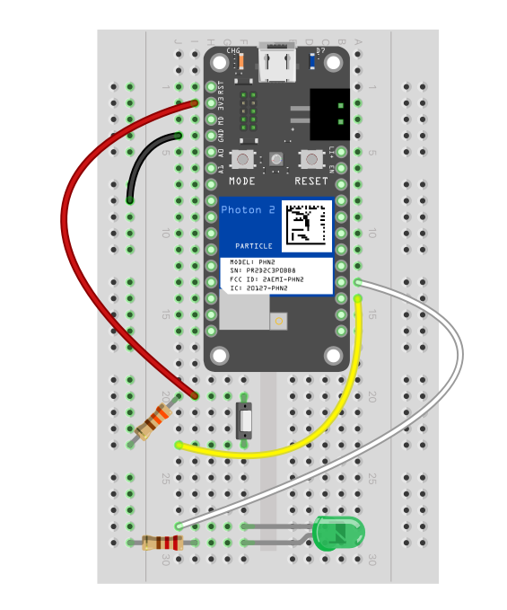

# Hello,

I'm [**Shryas Bhurat**](https://www.shryasbhurat.com), an **Engineer**, **Designer**, & **Technologist**.

Incredibly passionate about merging 
- Science
- Design
- Technology
- Entrepreneurship

To improve the quality of life.

# TDF Weekly Progress
[week 1](README.md#week-1-personalizing-my-new-berkeley-home) , 
[week 2](README.md#week-2-Exploring-Rhino-Grasshopper-and-3D-Printing-this-week) ,
[week 3](README.md#week-3-putting-all-skills-into-work) ,
[week 4](README.md#week-4-moving-towards-building-interactive-tools) ,
[week 5](README.md#week-5-playing-with-photon) ,
[week 6](README.md#week-6-playing-with-sensors) ,
[week 7](README.md#week-7-building-safe) ,
[week 8](README.md#week-8-safe-A-Personal-Safety-Assistant),
[week 9](README.md#week-9-experimenting-with-llms),
[week 10](README.md#week-10-LLM-that-enhances-my-portfolio),

---------------------------------------------------------------------------------------------------------

# Week 10: LLM that enhances my portfolio
## Week of 11/1/2024

### Reflections
Developing a language model (LLM) based on my portfolio and integrating it into my website offers a uniquely interactive experience, allowing visitors to engage directly with your career narrative, achievements, and projects. This dynamic approach not only enhances engagement but also makes my portfolio more accessible and inviting, especially for audiences who may prefer conversational interaction over static content browsing. Through this innovative application of AI, I've showcased the potential of LLMs in personal branding, positioning myself as forward-thinking and tech-savvy.

#### Level: Axolotl

This was a great learning for the project, as I worked on training my own models, fine tuning the parameters and taking the api keys to build a web application, that was completely new experience to build a llm for my portfolio with a presentable UI that matches the color themes and format of the portfolio.

#### [(Youtube Link)](https://www.youtube.com/watch?v=wmGF4PnKe8E)

#### Diagrammatic Analysis

Exploring the use of Large Language Models (LLMs) and training them with knowledge through simple drag-and-drop tools has been an exciting journey, as it enables the personalization of these models for specific use cases. This approach not only simplifies the process of adapting LLMs to individual needs but also opens up new possibilities for tailoring AI-powered solutions to diverse applications, making advanced language technology more accessible and customizable for various industries and purposes.

    

#### Process

Working with large language models (LLMs) for portfolio projects offers an exciting opportunity to showcase your skills in AI and natural language processing. One key aspect of such projects is fine-tuning the model parameters to optimize performance for your specific use case. This involves carefully adjusting settings like temperature to control the model's creativity, and determining appropriate chunk sizes with sufficient overlap to maintain context. Additionally, implementing an intuitive user interface that goes beyond simple text input can greatly enhance the user experience and demonstrate your ability to create user-friendly AI applications

    
    

#### Final Version

To make your LLM portfolio project stand out, consider incorporating features that highlight its practical applications. For instance, you could provide direct URLs to the full project, allowing viewers to explore the entire implementation in detail. Implementing a summarization feature that can concisely explain any part of the project on demand can showcase the model's versatility. Furthermore, designing a responsive UI that can handle various input formats, such as JSON files, demonstrates your ability to create flexible and robust AI solutions. These elements combined can create a compelling portfolio piece that effectively showcases your skills in both AI development and user experience design.

    
    

### Speculations
- Enhanced User Engagement: By allowing users to ask questions and get detailed responses about your work, you may find that users engage more deeply with your content, staying on your site longer and exploring aspects of your portfolio they might otherwise overlook.
- Future Integration with Job Search and Networking: This project could serve as a unique asset in job applications, networking, and interviews, as potential employers or collaborators could interact with your LLM-based portfolio to gain deeper insights into your expertise and experience. You could even tailor the model to different audiences, providing focused responses based on the visitor's goals or interests.
- Expansion to Other Professional Profiles: There’s potential to offer this type of project as a service for others who want to create an LLM-powered portfolio, opening avenues in consulting or even entrepreneurship.
- Privacy and Security Considerations: As the project grows, ensuring data privacy and security will be crucial, especially if you decide to include more sensitive or proprietary project information in the model.

### Conclusion

This LLM-enhanced portfolio project represents a significant step in personal branding, offering a more immersive and user-centric experience. It bridges the gap between static online portfolios and interactive user experiences, offering unique insights into my professional journey and potentially setting a trend for how professionals can leverage AI to communicate their stories.

Going forward, this project could be refined by analyzing user interaction data to understand what people are most interested in, helping you continue to adapt and personalize responses. Additionally, expanding this model to different platforms or integrating multimedia responses could further elevate the experience, making it even more engaging and comprehensive.

---------------------------------------------------------------------------------------------------------

# Week 9: Experimenting with LLMs
## Week of 10/28/2024

### Reflections
Exploring the use of Large Language Models (LLMs) and training them with knowledge through simple drag-and-drop tools has been an exciting journey, as it enables the personalization of these models for specific use cases. This approach not only simplifies the process of adapting LLMs to individual needs but also opens up new possibilities for tailoring AI-powered solutions to diverse applications, making advanced language technology more accessible and customizable for various industries and purposes.

### Experiment 1

The initial phase of the experiment, designated as Experiment 1, focused on implementing a straightforward approach to interact with OpenAI's language model. This involved utilizing a single module to establish a basic interface that could accept user input and generate corresponding output from the AI. Also, we called a postman request using api for the same program after experiment 4.

#### Images

    
     
     

### Experiment 2

Experiment 2 focused on leveraging a language model to process and understand Shryas Bhurat's resume, enabling it to provide personalized responses based on the information contained within. This experiment involved training a simple model with the resume data as input, allowing it to generate answers to queries about Shryas's professional background, skills, and experiences. By implementing this approach, the experiment aimed to demonstrate how AI models can be tailored to specific individuals, potentially enhancing their ability to assist with job-related inquiries or provide insights based on a person's unique professional profile. While the example provided uses a basic implementation, it illustrates the concept of training a model on personal data to create a more customized and relevant AI interaction.

#### Images

      

### Experiment 3

Experiment 3 is built upon the foundation established in Experiment 2, focusing on fine-tuning the model's performance by adjusting key parameters. This phase involved manipulating variables such as temperature, which controls the randomness of the output; the number of chunks, which affects how the input data is processed; and the similarity threshold, which determines how closely the model's responses match the training data. By systematically altering these parameters, the experiment aimed to optimize the model's ability to generate accurate and relevant responses based on Shryas Bhurat's resume. This process of experimentation and refinement demonstrates the importance of parameter tuning in achieving the desired balance between creativity and accuracy in AI-generated outputs, ultimately enhancing the model's effectiveness in providing personalized information.

#### Images

     
     

### Experiment 4

Experiment 4 advanced the previous work by introducing a more sophisticated approach to generating personalized responses based on Shryas Bhurat's resume. This iteration employed a single prompt input system instead of a conversational model, incorporating variables for location and year to provide context-specific information. The experiment utilized two AI models in tandem: the first model generated questions that included Shryas's name, the specified year, and location, while the second model accessed the knowledge bank containing resume data to formulate appropriate answers. This two-step process allowed for more nuanced and targeted responses. The experiment successfully implemented API calls using Postman, demonstrating the seamless integration of these AI models into a practical, request-response system. This approach showcased the potential for creating more dynamic and context-aware AI assistants capable of providing tailored information based on specific parameters and personal data.

#### Images

    
        
          

### Speculations

Based on the experiments, it's possible to envision a future where AI assistants become highly personalized and context-aware tools, capable of providing tailored information and insights across various domains. The successful integration of personal data, such as resumes, with adjustable parameters and multi-model approaches suggests that AI systems could evolve to offer more nuanced and accurate responses to complex queries. This technology could potentially revolutionize fields like career counseling, personalized education, and professional development by offering on-demand, customized advice based on an individual's unique background and circumstances. The seamless API integration demonstrated in the experiments hints at the possibility of these AI assistants being easily incorporated into existing software ecosystems, potentially leading to widespread adoption across various industries and applications.

### Conclusion

The experiments demonstrate a progressive evolution in the application of AI models for personalized information retrieval and response generation. Starting from a basic OpenAI interface, the experiments advanced to include resume-based training, parameter optimization, and finally, a sophisticated two-model system with API integration. Each stage built upon the previous one, showcasing the potential for creating increasingly accurate and context-aware AI assistants. The successful implementation of variables for location and year, along with the ability to generate relevant questions and answers, highlights the adaptability of these systems. The seamless integration with API calls further emphasizes the practical applicability of such AI models in real-world scenarios. Overall, these experiments provide a strong foundation for future research and development in personalized AI assistants, opening up new possibilities for AI-driven information retrieval and decision support systems.

---------------------------------------------------------------------------------------------------------

# Week 8: Safe A Personal Safety Assistant
## Week of 10/22/2024

### Reflections
We were stuck on GPS Integration, Gas Sensor Integration, Loudness Sensor Integration, Photon Communication, Overall Integration and documentation. This week we completed all of these to make sure we have a working prototype (3 devices actually), that can communicate with eachother and ensure students are safe in unsafe zones around campus. We did talk to lot of students about the same, and got validation that they would use the product, because students generally want to be safe and ensure safety of others as well. It was overall fun working in the team and we built something incredible.

#### Team Member Roles

- Shryas Bhurat, 03-Axolotl:  RGB LED, API and web API calls, Interaction with other photons, GPS Proximity, Overall Integration
- Sun-Q Kim 03-Axolotl: Gas Sensor, Loudness Sensor
- Mia Wu 03-Axolotl: Button, RGB LED, Vibrating Mini Motor, Battery Management

#### Problem & Solution

As Berkeley students, we constantly receive messages from the Berkeley Warn Me system of potential hazards and crimes that occur around the campus area. Most people shrug off the information believing it is irrelevant to them, reaches them late or disregarding its seriousness. The exact location of the event is often forgotten or ignored, which could render the Warn Me system useless. 

Design a physical system that alerts the students when they are near or in contact with a ‘Warn Me’ Zone. Zones are detected using a gunshot, gas leakage, and button which give coordinates of a potential zone. 
LEDs and Vibrating Motors let the user know of if they are close proximity to the location.

    
          

#### Diagram Analysis

- RGB LED (Common Cathode): The color of the LED changes based on the severity of the detected danger. For example:
- Green: Safe or low-level alert.
- Red: High danger, such as a detected gunshot or significant gas leak.
- Blue: Vibration (Haptic Motor Controller and Vibrating Mini Motor): The system activates the vibration motor for physical feedback when any danger is detected, enhancing user awareness.
- Cloud Communication: Upon detecting an alert from any sensor or button press, the Photon 2 sends data to Particle Cloud, which manages the distribution of alerts. Alerts are broadcasted to nearby devices, which respond by activating their own RGB LEDs and vibrating motors to indicate the detected danger.
- Feedback Loop: The system continuously updates based on inputs from sensors, adjusting the RGB LED’s color and vibration intensity accordingly, while keeping cloud communication active for alert distribution to nearby devices.

    
          

#### Prototyping
We tried multiple iterations of making different things work individually and work together. This week we completed all of these to make sure we have a working prototype (3 devices actually), that can communicate with eachother and ensure students are safe in unsafe zones around campus. We did talk to lot of students about the same, and got validation that they would use the product, because students generally want to be safe and ensure safety of others as well. It was overall fun working in the team and we built something incredible.

         
    
    

Demo Video Link: https://youtu.be/De8imr4Wb8M

### Challenges

#### Individual Challenges
- It was difficult to implement GPS Location Protocol so that Photons can communicate with eachother and work with different sensors together.
- It was difficult to merge the code for different sensors without breaking the initial functions.

#### Team Challenges

- Combining data from diverse sensors (loudness, gas, button) while ensuring they work together seamlessly. 
- The BME688 sensor's gas readings and loudness sensor data can fluctuate due to changing environmental conditions.
- Setting up secure and reliable communication between the Photon 2 and the Google Maps API through the Particle Cloud.
- The Gas Sensor had trouble accurately detecting nearby alcohol levels

### Speculations

- Create our custom hardware by miniaturizing components and cut down physical sizes and eliminating the breadboard
- 3D print a case for the device for easier wearable equipment in the form of a necklace or cloth pin
- Add Edge ML functions to detect gunshot sounds from other loud noises
-  LLM Agents can automatically accept calls and pinpoint WarnMe locations to add to the system

    
    
    

### Conclusion

- The "Warn Me" Zone alert system successfully detects hazardous areas using gunshot, gas leak sensors, and a manual alert button, providing real-time danger zone coordinates.
- LEDs and vibrating motors serve as clear, effective indicators to alert students when they are near or inside a danger zone.
- The system combines sensory technology and simple feedback mechanisms to ensure immediate awareness of potential threats.
- This design enhances student safety by offering a practical, responsive solution to detect various emergencies on campus.
- With further development, the system can be adapted for broader safety applications and improve emergency response protocols.

---------------------------------------------------------------------------------------------------------

# Week 7: Building Safe
## Week of 10/14/2024

### Reflections
As Berkeley students, we constantly receive messages from the Berkeley Warn Me system of potential hazards and crimes around the campus area. Most people shrug off the information believing it is irrelevant to them or disregarding its seriousness. The event's exact location is often forgotten or ignored, which could render the Warn Me system useless. Our objective is to design a comprehensive physical system that alerts users when they are near or in contact with a ‘Warn Me’ Zone. Zones are detected using a loudness sensor, gas sensor, and button which give coordinates of a potential zone. LEDs and Vibrating Motors let the user know if they are in proximity to the location.

#### Team Member Roles

- Shryas Bhurat, 03-Axolotl:  API and web API calls, Interaction with other photons, GPS Proximity, Management
- Sun-Q Kim 03-Axolotl: Gas Sensor, Loudness Sensor, Product design
- Mia Wu 03-Axolotl: Button, RGB LED, Vibrating Mini Motor, Battery Management, Product design

#### Analysis

##### Process or sequence diagram

###### Sensor Inputs:
- Loudness Sensor: Continuously monitors for loud, gunshot-like sounds.
- Gas Sensor: Detects the presence of harmful gases indicating fire or dangerous fumes.
- Button: Manually triggered by the user to send an alert.
- Photon 2 Microcontroller: Receives inputs from the loudness sensor, gas sensor, and button. Processes the input to determine the danger level (e.g., gunshot detected, gas detected, or manual alert) and activates the appropriate response.

###### Outputs:
-RGB LED (Common Cathode): The color of the LED changes based on the severity of the detected danger. For example:
Green: Safe or low-level alert.
- Red: High danger, such as a detected gunshot or significant gas leak. Vibration (Haptic Motor Controller and Vibrating Mini Motor): The system activates the vibration motor for physical feedback when any danger is detected, enhancing user awareness.
- Cloud Communication: Upon detecting an alert from any sensor or button press, the Photon 2 sends data to Particle Cloud, which manages the distribution of alerts. Alerts are broadcasted to nearby devices, which respond by activating their own RGB LEDs and vibrating motors to indicate the detected danger.
- Feedback Loop: The system continuously updates based on inputs from sensors, adjusting the RGB LED’s color and vibration intensity accordingly, while keeping cloud communication active for alert distribution to nearby devices.

    
          

#### Videos & Images

###### Level of Effort:
- RGB LED Integration: Moderate difficulty. Estimated time of 2-3 hours for connecting the RGB LED to the Photon microcontroller, configuring PWM outputs, and testing the color transitions.
- Button Setup: Low difficulty. Connecting the button to the Photon with a pull-down resistor is straightforward, requiring around 1 hour.
Loudness Sensor Setup: Moderate difficulty. Setting up and calibrating the loudness sensor will require 2-3 hours to ensure it correctly identifies sound thresholds.
- DRV2605L Vibration Motor Setup: High difficulty. This requires I2C communication, testing various vibration patterns, and ensuring proper responsiveness, likely requiring 4-5 hours.
- API and Web API Calls: High difficulty. Setting up APIs to interact with web services (e.g., cloud-based logging, notifications, or remote control) requires 6-8 hours. Time will be needed for coding, testing HTTP requests, and ensuring data security.
- Interaction with Other Photons: Moderate difficulty. Setting up communication between multiple Photons (via Particle Cloud) will take 4-6 hours. You will need to configure event-based communication for device-to-device interaction, test the communication channels, and manage data sharing across devices.
- Gas Sensor Setup: Moderate to high difficulty. Wiring and calibrating the gas sensor for detecting harmful gases will take 4-5 hours. This includes testing the sensor’s responses and ensuring it works seamlessly with the other components.
- Battery Management Setup: Moderate difficulty. Managing battery consumption with efficient power distribution and implementing low-power modes could take 3-5 hours to balance performance with battery life.
- Total Time Estimate: 25-33 hours for connecting, integrating, testing, and optimizing power management for all components.

    
    
          

### Speculations

###### Develop a proof of concept for a context-aware assistant, that can help students with safety.

- Gain insights into the effort required to implement core functionalities such as photon integration, context-aware assistance, and cloud integration. Ensuring all the sensors work well with the interactive system.
- Discover best practices for prototyping with distributed components, focusing on modular and scalable design.
- Talk to the dean and students to understand the pain points more effectively and include them in prototyping efforts.
- Share findings with our peers for feedback and continued community development.

This feasibility study aims to develop a Particle Photon2-based location tracker for Berkeley Warning Zones through systematic experimentation. By integrating Web APIs and Stemma QT through prototyping, the team will build a physical warning system that alerts users when they approach a location. The assistant will generate warning cues in the form of flashing LED Lights using Particle Cloud integration with the possibility of including uses of API to provide location-based contextual information, to cross-reference with the user’s location and data from Berkeley Warn Me messages. The study will emphasize understanding the usage of Gas sensors, Loudness sensors, and Vibration motors, and applying them to our knowledge of Particle Photon2 to develop a cloud-based system.

---------------------------------------------------------------------------------------------------------

# Week 6: Playing with sensors
## Week of 10/10/2024

### Reflections
I tried out the Soldering, importing libraries, playing with the MPU6050 sensor, and looking into outputs to look for innovative devices that can be made using this sensor. It was really fun to understand, how quickly the device was sensing movements, can be used for very high applications like building a drone because the feedback rate was really fast. I might use this sensor a lot of times.

#### Analysis
I started by soldering the stemma chip, to help me connect with other auxiliary sensors then connecting the photon to my home wifi and adding libraries to the visual studio code to run the MPU6050 sensor, the code shared showed LED output at D7, so built an led connection quickly and gave it a run, it complied fast.

#### Videos & Images

I got my hands dirty to solder the stemma chip and got some shots taken of me during the process for the report.

    
          

(Videos Loading)

#### Sensor 1: MPU6050 (Acceleration)
Running the sensor, after making a basic LED circuit for me to ensure the code is running and connecting the MPU6050 sensor to the device so that I can get consistent outputs. The output delay seemed to be very low, because it was instantaneous values, played around rotating the sensor, to see values change and it did!

    
         

(Videos Loading)

#### Sensor 2: APDS9960 (Gesture and Color)

Running the sensor, after making a basic LED circuit for me to ensure the code is running and connecting the APDS9960 sensor to the device so that I can get consistent outputs. The output delay seemed to be very low because it was instantaneous values, played around rotating the sensor, changing the colors that it inputted, and enclosing the sensor by hand to see values change and it did!

    
    
    

(Videos Loading)

### Alterations to make the LED blink faster and slower based on proximity

This utilizes the APDS9960 proximity sensor to control the blinking rate of an LED connected to pin D7 on a Particle device. The sensor continuously measures the proximity of objects, returning values between 0 and 255. These proximity values are then mapped to a blinking interval range of 50 to 1000 milliseconds. As objects move closer to the sensor, the proximity value increases, resulting in a shorter blinking interval and thus a faster blinking rate for the LED. Conversely, when objects are farther away or not detected, the proximity value decreases, leading to a longer blinking interval and a slower blinking rate. The code uses the `millis()` function to track time and toggle the LED state based on the calculated interval, creating a dynamic visual feedback system that responds to the presence and distance of nearby objects.

    
    

(Videos Loading)

### Diagrammatic Analysis

The diagram illustrates the proximity-based LED blinking system. The central node is "Proximity-Based LED Blinking," branching into four main areas: "Hardware Setup," "Proximity Detection," "LED Control," and "System Logic." Each branch represents a component or process involved in the system's operation.

    

### Speculations
I see myself using this sensor for applications that require feedback fast, something as autonomous drones, vehicles, and other devices while recognizing the external environments instantly. Saw some videos on using this sensor to build a self-balancing robot and it was fun watching them.

  
        

---------------------------------------------------------------------------------------------------------

# Week 5: Playing with Photon
## Week of 09/30/2024

### Reflections

This weekend, I delved into the world of electronics and IoT (Internet of Things) using a Photon device. I started by connecting the Photon to the internet, which allowed me to control and monitor it remotely. Then, I set up a breadboard, which is a platform for prototyping electronic circuits without soldering. On this breadboard, I added various electronic components to experiment with.

My first project was to make an LED bulb blink, which is often considered the "Hello World" of hardware programming. I tried different patterns and speeds of blinking to understand how to control the timing. Next, I explored the use of sensors. I worked with a pressure sensor, which is an analog sensor that provides a range of values, and a button, which is a digital sensor that gives either an on or off signal. I connected these sensors to the Photon and observed the data they produced on the serial monitor, which is a tool that displays the output from the device.

I first began with connecting my photon with the home internet, it was easy to follow to tutorials to get it connected to the internet.

    

(Videos Loading)

Then I ran few codes on printing Hello world in different ways, with different delays to understand on how to flash photon software, what happens during compilation, how to look at serial monitor, go deeper into delays and why they are important, below are my iterations.

Some playing videos:
1. Printing Hello world.
2. Printing Shryas Bhurat, but one word in a line.
3. Priting Shryas Bhurat, with different delay rates.

    
    
    

(Videos Loading)

-----------------------

### Project 1: Button -> LED pulse rate

#### Diagrammatic Analysis of a Microelectronics Project

Some playing videos:
1. Micro Electronics Circuit.
2. Micro Electronics Setup.
3. Micro Electronics Run.

    
    
    

(Videos Loading)

Then I put all that I learnt about resisters, photon, delays, flashing, connecting it to internet and bread boards to blink a bulb with 3 volts of voltage using the diagram shared on how to make connections, I also had to add few resistors so that the current flow can be reduced suitable for both bulb and the button added to change the delay randomization for the software.

The images/videos below show button pressed to change the speed of the delay (300 ms - 1000 ms & 30 ms to 300 ms), blinking fast and blinking slow based on button pressed to change the speed within the range.

Some playing videos:
1. Button Pressed shown on Terminal.
2. Blink Slow based on lower range on periodicity.
3. Blink Fast based on higher range on periodicity.

    
      
        

(Videos Loading)

#### 2 LED's blinking setup (Experiment)

I also tried to use 2 LED's electronic wiring, with one more digital read out in use, connections similar to prebvious one but for a new LED.

    
        

#### STOP & START when button is pressed for 3 LED's (Experiment)

Then went to on write a code that can make the LED's off when the button is pressed and once it is pressed again the LED's periodicity is randomized for 3 LED Setup.

    
        

(Videos Loading)

#### Difference

The key difference in this example is the introduction of variable pulse rates for the LED based on button presses. Instead of a simple on/off state, the LED's blinking speed changes dynamically in response to user input. This creates a more interactive and nuanced output compared to a basic button-controlled LED circuit.

#### Similarities
- Both systems use a button as an input device
- An LED is used as the output in both cases
- The basic principle of user interaction triggering a change in the LED's state is maintained

#### New Feature

The new feature is the variable pulse rate of the LED. This allows for multiple states or "levels" of output, providing more information to the user than a simple on/off LED. The pulse rate could potentially convey different meanings or intensity levels, making the system more expressive and informative.

#### Machine Learning

- An ML model could analyze the timing and frequency of button presses to predict user intent or mood.
- A system could learn from user interactions over time to optimize the range of pulse rates for better user experience.
- ML algorithms could identify unusual patterns of button presses that might indicate a malfunction or unauthorized use.

#### Larger Ecosystem

- The button and LED could be part of a wider home automation system, where the pulse rate indicates the status of various home systems.
- Button press patterns could be logged and analyzed to gain insights into user behavior or device usage over time.
- The button and LED could be connected to a network, allowing remote triggering or monitoring of the pulse rate.
- Multiple button-LED pairs could work together in a coordinated system, creating more complex interaction patterns or information displays.

-----------------------

### Project 2: FSR -> LED color

#### Diagrammatic Analysis of a Microelectronics Project 2

From my understanding of the project, the sensor takes input in numbers more than just binary, this is because as the pressure chnages with hand movements the resistance changes and it computes a value that is transmitted to the photon device and sent to the LED with some computation on numbers to be showed in R,G,B and it can be randomized even more.

    

    
        
        

(Videos Loading)

#### Difference

The project was really different as I could feel the sensor and the light in more interactive way than a normal button. The FSR sensors are pretty good and detecting pressure's and compute the values for resistance, which is anolog to the digital sensors with only binary values.

The key difference in this example is the use of a Force Sensitive Resistor (FSR) as the input device, replacing the button. This allows for a continuous range of input values based on applied pressure, rather than the binary on/off state of a button. The LED output is also different, changing color instead of pulse rate, providing a visual representation of the applied force.

#### Similarities
- Similar connection patterns in terms of voltage and ground connections that are required for the setup.
- Both systems use an LED as the output device
- User interaction is still the primary trigger for changes in the LED's state
- The basic principle of input affecting output is maintained

#### New Feature

The new feature is the color-changing capability of the LED. This allows for a more nuanced and visually diverse output compared to a single-color LED. The color spectrum can represent a wide range of input values, potentially providing more detailed information about the force being applied to the FSR.

#### Machine Learning

- An ML model could learn to predict the amount of force applied based on subtle changes in the FSR readings.
- Machine learning algorithms could potentially identify different users based on their unique pressure patterns when interacting with the FSR.
- Over time, an ML system could adjust the color mapping to optimize visibility or to compensate for wear on the FSR.

#### Larger Ecosystem

- The color output could be part of a larger haptic interface, providing visual cues alongside tactile feedback.
- The system could be used to create pressure-sensitive input devices for individuals with limited mobility, with color output providing clear visual feedback.
- Multiple FSR-LED units could be combined to create large-scale, interactive light displays responding to audience touch.
- The technology could be incorporated into exercise machines or sports gear to provide immediate visual feedback on applied force or technique.

-----------------------

### Project 3: Button send-on-change

#### Diagrammatic Analysis of a Microelectronics Project 3

From my understanding of the project, this was more hands on towards sending the data to cloud when a button is pressed, similar to above setup but goes deeper into state variables that changes when there is change in input and i see possibilities of this being used in different settings.

    

    
        

(Videos Loading)

#### Difference

The key difference in this example is the implementation of a state-change-based data transmission system (key term). Unlike simple button-press detection, this approach only sends data to the Particle.io cloud when the button's state changes from pressed to released or vice versa. This  can result in more efficient use of network resources and power.

#### Similarities
- Uses a button as an input device, similar to basic button circuits
- Employs an LED for visual feedback, a common practice in many IoT projects
- Utilizes a microcontroller (Photon 2) for processing and control, typical in IoT applications

#### New Feature

The new feature is the conditional publishing of data based on state changes. This approach introduces a more sophisticated event-driven programming model, where data is only sent when there's a meaningful change in the input state.

#### Machine Learning

- Pattern recognition: The timing and frequency of button presses could be analyzed to predict user behavior or detect anomalies.
- Adaptive debouncing: ML algorithms could optimize the debounce delay based on usage patterns.
- Predictive maintenance: By analyzing button press patterns over time, ML models could predict when the button might fail or require maintenance

#### Larger Ecosystem

- The button could trigger various actions in a connected home environment.
- Button press patterns could be logged and analyzed for user behavior insights4.
- The system could be part of a larger network of devices, allowing for remote status checks and control4.
- The button data could be combined with other sensor inputs (e.g., temperature, motion) for more complex decision-making in IoT applications

-----------------------

### Speculations

I think this will be a very useful skill and will help me to work on projects that have hardware aspects to it. I look forward to playing more with photon, to build a interactive tool that can take data realtime in a hardware setting and transfer it to the software aspects, so that we can learn from the tools/wearable that we use, similar to smart watches and digital devices. I am excited to delve into the world of hardware-software integration, particularly using devices like Photon. This will allow me to create interactive tools that can collect real-time data from the physical environment and transmit it to software systems for analysis. I see this as a valuable skill that will enable me to work on projects with both hardware and software components, similar to the technology used in smart watches and other digital devices. From building simple sensor-based projects to developing more complex wearable devices. By honing my skills in hardware programming, data communication, and software development, I'll be able to create innovative solutions that bridge the gap between the physical and digital worlds. This knowledge will not only enhance my understanding of Internet of Things (IoT) concepts but also open up new opportunities for me to contribute to fields such as health monitoring, smart home technology, and industrial automation.

### Quick Links:
- Link to changing wifi's (Open on google): https://docs.particle.io/tools/developer-tools/configure-wi-fi/

---------------------------------------------------------------------------------------------------------

# Week 4: Moving towards building interactive tools
## Week of 09/23/2024

### Reflections

I started by reflecting on my journey, on what I use in daily life, and how each object shares data and works together. There are a lot of feedback mechanisms built in the systems currently that I realized today as I noticed the interactions of digital systems in sharing data to make our lives easier. 

### Devices & tools that I use every day.

1. Smart Phone
2. Laptop
3. Smart Watch
4. Smart Speaker
5. Email
6. Calendar
7. Wallet
8. Credit Card
9. Bank Account
10. Google Meet
11. Online Shopping Applications
12. Movie Streaming & Video Streaming Services
13. Gaming Applications
14. Refrigerator
15. Smart Lights
16. GPT

### Diagrammatic Analysis

- Calendar, Gmail, and Video Conferencing are linked to each other and constantly transfer data.
- Wallet, Credit Card, and banking applications are linked to each other and constantly transfer data.
- Laptop is linked with Bluetooth or wireless speakers at home, it is also linked to wireless mouse and keyboard to transfer and receive data.
- Smart phone and smart watch are linked together to track health goals, messaging, calls and other application-oriented activities that tend to become invisible with proper feedback loops.
- Smart phones are also linked to refrigerators, smart light and thermostats to make home settings more friendly and interactive.
- Social media applications like instagram & whatsapp are linked to eachother, to learn from users data and show us advertisements on the same.

Here is a diagram to show how things relate to each other with feedbacks that they tend to transfer to each other.

  

    

(Videos Loading)

### System Interaction put to action

#### This week I also attended a AI Hackathon, focused towards health with SunQ and Josh from the MDes Cohort and we ended up building a interaction system between phone call, llm's, human dispatchers, hospitals and ambulance providers.

    

(Videos Loading)

- problem: every minute matters in an emergency scenario and response can be slowed down by manual operation and human error
- solution: an ai voice workflow to help automate triaging and response 
- Link to the video: https://youtu.be/Zw503GZLikM

### Map for systems interacting for the product we built during the hackathon

    

    

(Videos Loading)

This is the framework that helped me understand how machines interact with each other and transfer data to optimize processes.

### Speculations

I feel the world is getting more and more connected with data transfer from one application to another, all the Google applications are linked to each other. Some connect to other applications using application protocol interface, to transfer data. We are always communicating with the world using the internet and it's getting more and more every day. 

With AI playing a huge role in the current world, we will soon see a world where all these interfaces become even more invisible. The communication layer is still invisible but sooner we will see a world where the interface layer becomes invisible too.

---------------------------------------------------------------------------------------------------------

# Week 3: Putting all skills into work #
## Week of 09/16/2024

### Reflections
I want to push myself to build a model from scratch and make use of my skillsets to build something that solves a real problem for me and has a real use case. As you know I moved to Berkeley and am setting up my room, my charging area is currently messed up with too many things moving, and too many cables, it does not look elegant at all, so I wanted to build a stand that can hold my phone and also my I watch and charge them at once.

#### Storyboard

    

- Frame 1: Moving to Berkeley, USA from Home back in India
- Frame 2: Moving to a new home without any furniture and essentials
- Frame 3: Its frustrating after long day at college to go back home and find the charger from the clunk of messy wires
- Frame 4: I use 3D Printing, parametric modeling using Grasshopper and design something that can help me solve this problem.
- Frame 5: Utilizing charging station concept where I can throw my watch to the stand, it sticks around and fuels my watch and phone.
- Frame 6: Easy to handle with edge fillets and understanding the model on how to use it.

### Project Challenge Level Rationale
#### Challenge level: 03 - Axolotl

I’m very new to grasshopper-based modeling and never used tools like these for modeling before. I had to figure out how to use it by watching videos and getting help from people around me in the cohort. I started working on Rhino first to see how the models are created in it, the user interface was quite daunting for me initially, but then playing around with the charger stand files shared, I started to interact with the system. I then tried to build a rectangular box on my own, just to see how the grasshopper modeling works, and then pursued to build something that I wanted for my home. I was new to 3D printing as well since I had to learn how support structures work, and tolerancing working on different systems and filaments to use. Working on these many iterations streamlined the process for me and I then built the model from scratch pushing myself to learn new things along the way, I learned a lot about dimensioning, modeling, tolerances, fillets, and other human-centered design aspects. Thus I consider this project to be an Axolotl level one.

### Working

My experiments with computational design technologies significantly influenced my Charging Station design. The parametric modeling capabilities of Grasshopper allowed me to easily adjust dimensions and features, facilitating rapid iterations and refinements. This flexibility, combined with my newly acquired knowledge of dimensioning, tolerances, and fillets, enabled me to create a more ergonomic and user-friendly design that incorporated important human factors considerations.

My exploration of 3D printing techniques directly impacted my design's printability. I adjusted my model to minimize support structures and optimize print time and material usage. The ability to quickly prototype and test designs allowed me to address challenges such as integrating the Apple Watch charger and refining the overall form factor. This iterative process, enabled by the combination of parametric modeling and 3D printing, ultimately led me to create a functional, customized charging station that effectively solved my initial problem while demonstrating the potential of computational design technologies in creating practical solutions.

    

#### To make it easy for me to utilize the resource while making it look elegant.

    
     

### Human Factors (AEIOU Framework)

- Activitiy: To solve the problem for a place/equipment where I can charge my mobile and iwatch without any issue, currently I keep it on the floor.
- Environments the activity takes place everyday when I get home from college and need to charge my watch and phone
- Interactions are between me and the charger that I use to charge the watch and phone, I charging seamlessness would depend on the time I keep them to charge and usually its frustrating to find the right charger, turn and unturn them because they get messy overtime.
- Objects I utilized sketches, design on grasshopper, dimensioning and tolerancing, 3d printing software, perplexity to solve my queries to build it.
- User: I’m the user and I’m usually tired going home after college and want to instantly put all my electronics gadgets on charge, the immediate need to find the charger that fits well on the first time was really crucial for me as I went on to solve this problem. It has to have human factors included in the design so that it can be handled easily.

#### Youtube Video
https://www.youtube.com/watch?v=eQastMoem7A (fun video to watch)

After trying out 3D printing, I decided to learn something new - video editing. I made a video that shows all the different things I've been working on lately. This video is like a big picture of my projects. It probably shows my 3D printed stuff, but it also has parts where I used my new video editing skills. I might have added cool transitions between scenes, made the colors look better, fixed the sound, or even put in some special effects. By making this video, I got to practice my new editing skills while also showing off my 3D printing work. 

### Images

    
    

### Outcomes
- The working battery charging stand prototype, so that it can charge my phone easily.
- Human factors into consideration with fillets and wire extrusions so that it look neat, tidy and sturdy.
- Form factor so that it can seamlessly integrate with in my surroundings in the room.

### Speculations

I thought everything would work perfectly on my first try with 3D printing, but I was wrong. I had to do it over and over again, learning more each time. This taught me a lot about how 3D printers work and what they can and can't do well. I found out that tiny differences in measurements matter a lot in 3D printing. By trying many times and making small changes, I got better at understanding how the printer, the materials, and my designs all work together. Now, I can make better 3D prints, and I really see how amazing and tricky 3D printing can be for making things.

#### Exploring computational design technologies

As a newcomer to computational design, I immersed myself in learning Grasshopper and Rhino. I started by familiarizing myself with Rhino's interface, which I initially found daunting. To gain comfort, I examined existing charger stand files and practiced creating basic shapes & playing around with pre built model. This foundation allowed me to transition into Grasshopper, where I began experimenting with parametric modeling by creating simple geometries like rectangular boxes. I relied heavily on tutorial videos and sought assistance from my cohort members. This iterative learning process enabled me to progress from basic shapes to more complex designs in Grasshopper. Simultaneously, I explored 3D printing technology, experimenting with support structures, various filaments, and printer settings. This hands-on approach to both digital modeling and physical production gave me a comprehensive understanding of the entire design-to-fabrication process, which was crucial for my project's success.

### Conclusion: 
My Charging Station project has been a great journey into the world of computational design and digital fabrication. As a novice in Grasshopper-based modeling and 3D printing, I faced numerous challenges that pushed me to develop new skills and problem-solving abilities. Through iterative design and prototyping, I not only created a functional solution to my everyday charging needs but also gained valuable insights into parametric modeling, human-centered design, and additive manufacturing. This experience has demonstrated the power of computational design tools in solving real-world problems and how they can empower individuals to create customized solutions. The project's success, evidenced by a functional and aesthetically pleasing charging station that integrates seamlessly into my living space, stands as a testament to the potential of combining creativity with technology, has also laid a strong foundation for future endeavors in design and engineering, showcasing the immense value of learning through hands-on experience and perseverance.

---------------------------------------------------------------------------------------------------------

# Week 2: Exploring Rhino Grasshopper and 3D Printing this week #
## Week of 09/07/2024

### Reflections
Rhino seems like an interesting software to build things as it is parametric and things can be edited quite quickly because of this. I wanted to make the phone stand for my phone dimensions so that I could keep it comfortably on my study table.

#### Diagrams

My Understanding of Parametric Modeling

I've found out that Rhino is a really cool software for making things. It's special because it lets me change my designs quickly and easily. This is because it uses something called parametric modeling. I want to use Rhino to make a phone stand that fits my phone perfectly and looks good on my study table. I'm excited to put in my phone's size and play around with different designs. I can change things like how tall the stand is, what angle it sits at, and even add a spot for my charging cable. The best part is, if I want to change anything, I just need to change some numbers and the whole design updates by itself.

This way of designing things is great because I can try out lots of different ideas really fast. I don't have to start over from the beginning every time I want to make a small change. I'm looking forward to making something that's not just useful, but exactly right for me and my study setup. Plus, I'll be learning how to use a powerful tool that I can use for other projects in the future. Once I'm happy with my design, I might even 3D print it or find another way to make my custom phone stand for real. I think this project will help me understand how to make things that can easily change and grow with what I need.

    

I tried to edit the parameters to the iPhone XR dimensions

    
    

When I first tried to make my phone stand, I ran into a problem. The base I designed wasn't thick enough, which meant the center of gravity (CG) of my phone was outside the area that would keep it stable. This is because the CG is really important for keeping things from tipping over. If the CG is too far outside the base, the object will fall.

To fix this, I had to think creatively. I decided to change the angle of how the phone sits on the stand. By adjusting the angle, I was able to bring the CG back inside the stable area. This made the whole stand much more stable, even with a thinner base. It was a good lesson for me in how small changes in design can make a big difference in how well something works. I learned that when designing things like phone stands, it's not just about how it looks, but also about understanding basic physics principles like center of gravity and stability.

    
    

It worked, the phone was more stable and I could bake the results instantly & then I tried to replace the base with a cylinder.

#### Images

    
    
     

I then created a 3D file to print the output so that I could use it.

#### Box for storage near my bed

I attempted to create a custom design using Grasshopper, a visual programming tool for 3D modeling. My goal was to make a practical storage solution for the area near my bed. Specifically, I wanted to design a box that could neatly organize and hold my various chargers. This project aimed to combine functionality with personalized design, allowing me to keep my bedside area tidy and have easy access to my charging cables. By using Grasshopper, I could experiment with different shapes, sizes, and compartments to create a box that perfectly fit my needs and the available space next to my bed.

#### Images

    
    
     

#### Speculations

It was fun to play with parameters and very quick iterations. I see this being used with the technology and large learning models to build cad models faster. I also see me using this tool to enable me for fast prototyping and learn from failures faster.

I've discovered that Rhino is a really cool software for building things, especially because it's parametric, which means I can edit my designs quickly and easily. I've decided to use it to make a phone stand that's perfect for my phone's dimensions. This way, I can keep my phone comfortably on my study table while I work. I was excited to input my phone's measurements and play around with different designs. I can adjust things like the angle of the stand, how tall it is, and even add a spot for my charging cable. What's great is that if I want to change anything, I can just tweak the numbers and the whole design will update automatically. This means I can experiment with different ideas until I get the stand just right for my study setup. 

I'm looking forward to creating something that's not only useful but also perfectly tailored to my needs.

---------------------------------------------------------------------------------------------------------

# Week 1: Personalizing My New Berkeley Home #
## Week of 09/05/2024

### Reflections

After moving to Berkeley, I moved to a new home and wanted to make it more personal space, hence this week I worked on mini projects for my study table and home.

## DIY Projects

### Cool Pencil Stand

I made a cool pencil stand to organize my writing tools and add a unique touch to my study area. This custom-made stand serves a practical purpose and reflects my style using 3D Printing.

    
    
    

### Custom Keychain

For my new home keys, I created a custom keychain. This personalized accessory helps me easily identify my house keys and adds a bit of flair to my everyday items using 3D Printing.

    
    
    

### Cal Logo for My Table

I made a Cal Logo for my table to show my connection to my new academic community. This decorative piece proudly displays my affiliation with the University of California, Berkeley, and adds a touch of school spirit to my study space using Laser Cutting.

    
    

## Impact

These DIY projects have helped me transform my new living space into a more personalized environment. By adding these custom touches, I've begun to make my new Berkeley home feel more like my own.

In the future, I will try to merge technology tools to build something that can solve my problems in the quickest way possible.

---

## Quick Links ##

- [TDF Wiki](https://github.com/Berkeley-MDes/24f-desinv-202/wiki) - the ultimate source for truth and information about the course and assignments
- [Google Drive Folder](https://drive.google.com/drive/u/0/folders/1DJ1b6sSDwHXX6NRcQYt10ivyQSgU0ND6) - slides and other resources
- [bCourses](https://bcourses.berkeley.edu/courses/1537533) - where the grading happens
- [Weekly Submission Form]( https://tinyurl.com/DESINV202-PersonalReflections) - where reflection happens

